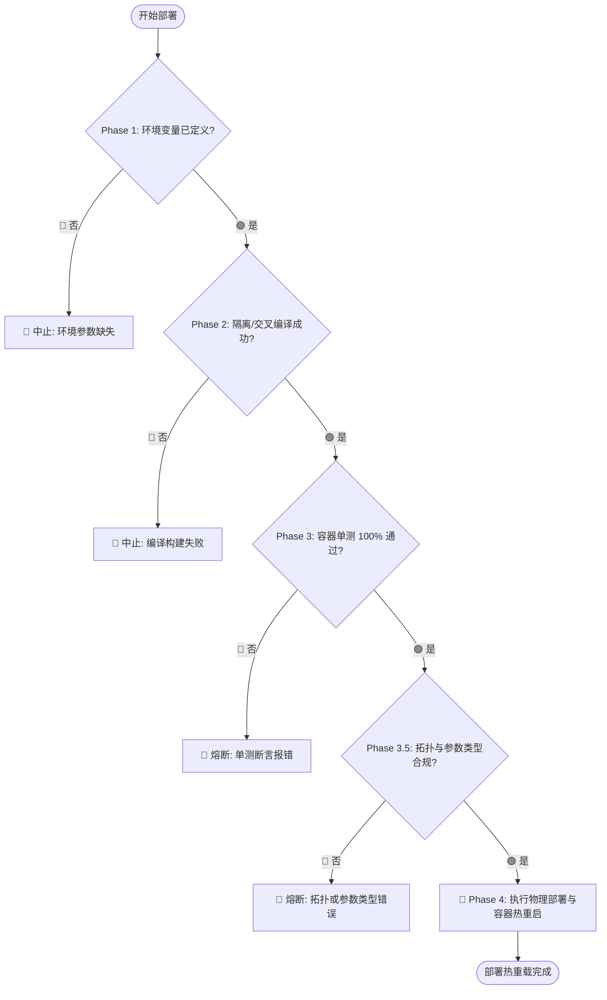

# 📖 C++ 雷达算法统一部署运维手册 (cpp_algorithm_ops)

本手册是 [uestcradar](file:///home/zikun/code/common/uestcradar) 算法解耦仓库进行物理多节点部署和调试的唯一权威规范。

---

## 🗺️ 五阶段部署决策流 (If-Else)

---

## ⚡ 核心工作流引导

本技能通过**渐进式透露原则**，按阶段将操作拆分为以下独立文档：

* 📋 **[第一阶段：环境变量配置](file:///home/zikun/code/common/uestcradar/.agents/skills/cpp_algorithm_ops/references/phase1-environment.md)**：定义远程节点拓扑、连接参数与硬件架构特性。
* 🔨 **[第二阶段：Docker隔离编译](file:///home/zikun/code/common/uestcradar/.agents/skills/cpp_algorithm_ops/references/phase2-compilation.md)**：基于架构自适应选择容器安全构建插件。
* 🛑 **[第三阶段：单测前置熔断](file:///home/zikun/code/common/uestcradar/.agents/skills/cpp_algorithm_ops/references/phase3-testing-shield.md)**：测试前置校验熔断防线，防范故障代码上线。
* 📋 **[第3.5阶段：流图拓扑合规性静态校验](file:///home/zikun/code/common/uestcradar/.agents/skills/cpp_algorithm_ops/references/phase3_5-topology-check.md)**：审查 YAML 拓扑参数、探针挂载以及参数类型防死锁校验。
* 🚀 **[第四阶段：物理部署热重载](file:///home/zikun/code/common/uestcradar/.agents/skills/cpp_algorithm_ops/references/phase4-distribution.md)**：物理覆盖分发插件并重启运行容器。

## 🐳 Docker 编译镜像定义

* 📄 **[极简本地同构编译 (Dockerfile.build)](file:///home/zikun/code/common/uestcradar/.agents/skills/cpp_algorithm_ops/Dockerfile.build)**：本地 X86 原生开发隔离编译底座。
* 📄 **[极简 AArch64 交叉编译 (Dockerfile.build_cross)](file:///home/zikun/code/common/uestcradar/.agents/skills/cpp_algorithm_ops/Dockerfile.build_cross)**：跨平台 AArch64 快速交叉编译环境。

## ⚡ 自动化控制脚本

* 🛠️ **[1. 代码同步与编译脚本 (build.sh)](file:///home/zikun/code/common/uestcradar/.agents/skills/cpp_algorithm_ops/scripts/build.sh)**：自适应目标机架构，在本地 Docker 中隔离进行同构编译或 AArch64 交叉编译。
* 🧪 **[2. 容器单测熔断脚本 (test.sh)](file:///home/zikun/code/common/uestcradar/.agents/skills/cpp_algorithm_ops/scripts/test.sh)**：直接在本地开发机自检容器中挂载运行单测，未通过则前置拦截熔断。
* 🚀 **[3. 覆盖分发与热重载脚本 (deploy.sh)](file:///home/zikun/code/common/uestcradar/.agents/skills/cpp_algorithm_ops/scripts/deploy.sh)**：在本地执行流图拓扑合规及参数类型防死锁静态校验（Phase 3.5），通过后跨网络将 `.so` 产物分发推送并热重启容器。
