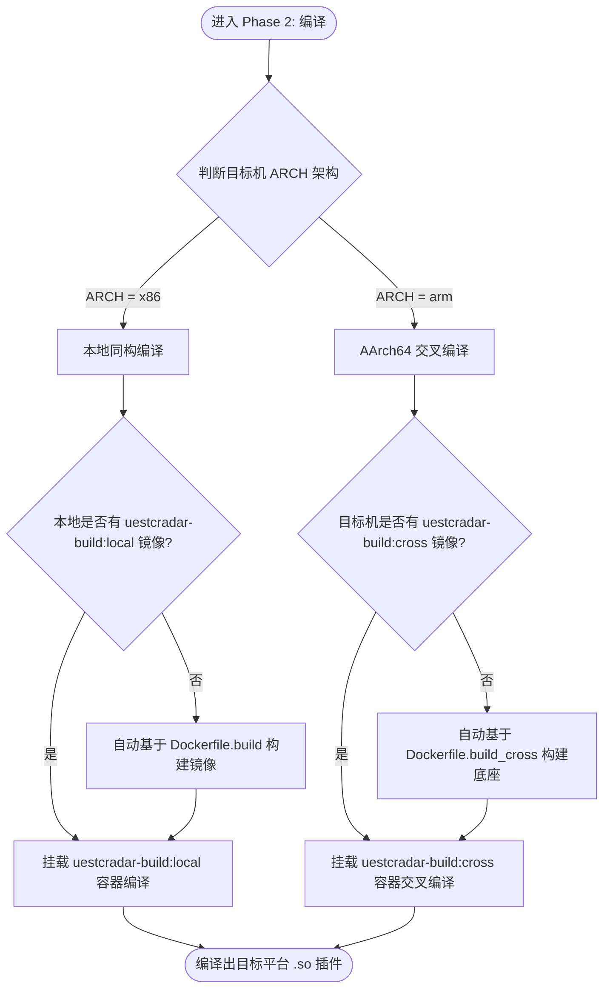

# Phase 2: 基于 CPU 架构的隔离编译与交叉编译

为了确保算法插件在不同运行环境中的绝对兼容性，以及防止本地库对编译产生的重定位（Relocation）链接污染，我们统一在专属 Docker 隔离镜像中执行编译构建。

编译系统在运行 `docker run` 编译前，**必须首先检测本地是否存在指定的构建镜像**，若无则自动触发 `docker build` 进行底座自愈构建。

---

## 🗺️ 编译决策流



---

## 1. 本地同构编译 (X86 开发机 -> X86 二进制)

适用于在本地宿主机或本地 x86 容器中进行流图调试。

### 自动化构建与编译指令：
```bash
# 1. 自动判定并构建编译镜像
if ! docker image inspect uestcradar-build:local &>/dev/null; then
  echo "未检测到本地编译底座，开始自动构建 uestcradar-build:local..."
  docker build -t uestcradar-build:local \
    -f .agents/skills/cpp_algorithm_ops/Dockerfile.build \
    .agents/skills/cpp_algorithm_ops
fi

# 2. 挂载 uestcradar 工作区在容器中编译
docker run --rm \
  --user "$(id -u):$(id -g)" \
  -v "$(pwd):/workspace" \
  -w /workspace/cpp \
  uestcradar-build:local \
  bash -lc "cmake -B build -DCMAKE_BUILD_TYPE=Release && cmake --build build -j\$(nproc)"
```
编译产出为 `cpp/build/lib/` 下的各类 `.so` 插件。

---

## 2. 跨平台交叉编译 (X86 开发机 -> ARM64 二进制)

适用于将插件直接推送到远端 ARM64 物理机（如 `node2`、`node4` 等物理板卡）运行环境。

### 自动化构建与编译指令：
```bash
# 1. 自动判定并构建交叉编译底座镜像
if ! docker image inspect uestcradar-build:cross &>/dev/null; then
  echo "未检测到交叉编译底座，开始自动构建 uestcradar-build:cross..."
  docker build -t uestcradar-build:cross \
    -f .agents/skills/cpp_algorithm_ops/Dockerfile.build_cross \
    .agents/skills/cpp_algorithm_ops
fi

# 2. 调用交叉编译器一键编译出 ARM64 插件
docker run --rm \
  --user "$(id -u):$(id -g)" \
  -v "$(pwd):/workspace" \
  -w /workspace/cpp \
  uestcradar-build:cross \
  bash -lc "cmake -B build_cross -DCMAKE_BUILD_TYPE=Release -DCMAKE_CXX_COMPILER=aarch64-linux-gnu-g++ -DCMAKE_C_COMPILER=aarch64-linux-gnu-gcc && cmake --build build_cross -j\$(nproc)"
```
编译产出为 `cpp/build_cross/lib/` 下的各类 `.so` 插件，可直接分发至远端物理机使用。

---

## ❓ FAQ: 常见编译与重载故障排查

### Q1: 远端物理机容器启动加载插件时，流图引擎报错 "cannot open shared object file: No such file or directory"，但该路径下的 `.so` 确实物理存在，这是什么原因？

* **A**: **100% 为 CPU 架构不匹配（即在 ARM64 主机上加载了 X86_64 格式库）。**
  Linux 动态链接器检测到 ELF 头部架构不匹配拒绝载入，会误报“文件不存在”进行隐蔽报错。
* **修复红线**：禁止修改目录权限或物理映射。必须立刻在本地使用 [build.sh](../scripts/build.sh) 交叉编译生成正确的 AArch64 二进制动态库再执行部署。

---

---

## 🛠️ 自动化编译快捷脚本

在项目专属运维技能包中，我们预置了自适应编译脚本。您可以在项目根目录下通过相对路径直接调用：
* **脚本路径**：[.agents/skills/cpp_algorithm_ops/scripts/build.sh](../scripts/build.sh)
* **调用指令**：
  ```bash
  bash .agents/skills/cpp_algorithm_ops/scripts/build.sh
  ```
* **自动化行为**：自动读取本地专属 `.env` 配置环境，自适应判定其 ARCH 硬件架构。若为本地同构则启动 `uestcradar-build:local` 编译；若为 ARM64 物理板卡则启动 `uestcradar-build:cross` 交叉编译，在本地直接输出适合该节点的 `.so` 插件。

