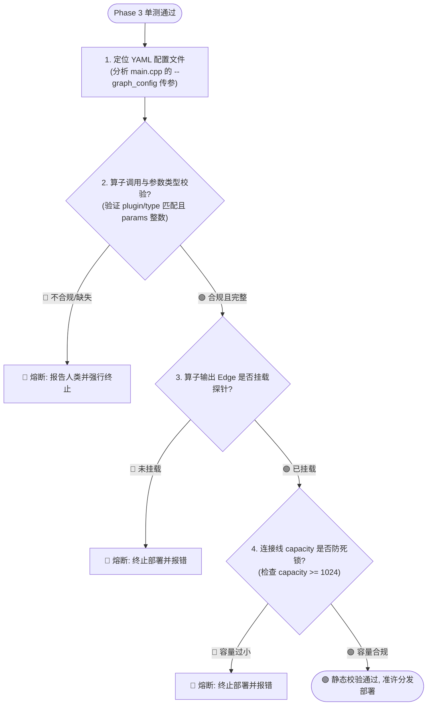

# Phase 3.5: 雷达流图拓扑合规性静态校验

在 Phase 3 单测通过后，必须对目标物理节点所加载的 YAML 拓扑执行以下静态规则检查：

---

## 🗺️ 拓扑合规校验决策流

---

## 📌 第一步：定位 YAML 配置文件
* **代码依据**：**[lib/du/app/main.cpp](file:///home/zikun/code/common/cycore/lib/du/app/main.cpp#L174)**。
* **规则**：`du_main` 启动时读取 `--graph_config` 参数指定 YAML，缺省加载 `default_graph.yaml`。在目标节点启动命令中确认实际生效的文件（如 `node2_graph.yaml`）。

---

## 📌 第二步：算子与参数校验
* **核对项**：
  1. YAML 中的 `type`（如 `algorithm.fft_cs16`）和 `plugin`（如 `cycore_fft_plugin.so`）必须与算子导出名一致。
  2. 必须包含 `params:`，且必要运行参数（如 `fft_size`）存在且为整数类型。
* **熔断**：若缺失参数或类型错误，立即终止部署并向人类报告错误上下文。

---

## 📌 第三步：探针挂载检查
* **核对项**：算子输出 Port 对应的 `connections.name`（如 `fft_to_sink`）必须存在于 `probes.edge` 声明中，确保诊断波形可被订阅。

---

## 📌 第四步：缓冲容量防死锁校验
* **容量规则**：
  * `connections.capacity` 必须大于或等于算子单次 Cube 读取量（如 1024 点 FFT 容量必须 >= 1024）。
  * `probes.frame_size` 必须与单次 Cube 读取量等值对齐。
* **熔断**：若容量或帧大小小于单次 Cube，强行熔断部署以防止流图发生死锁。
