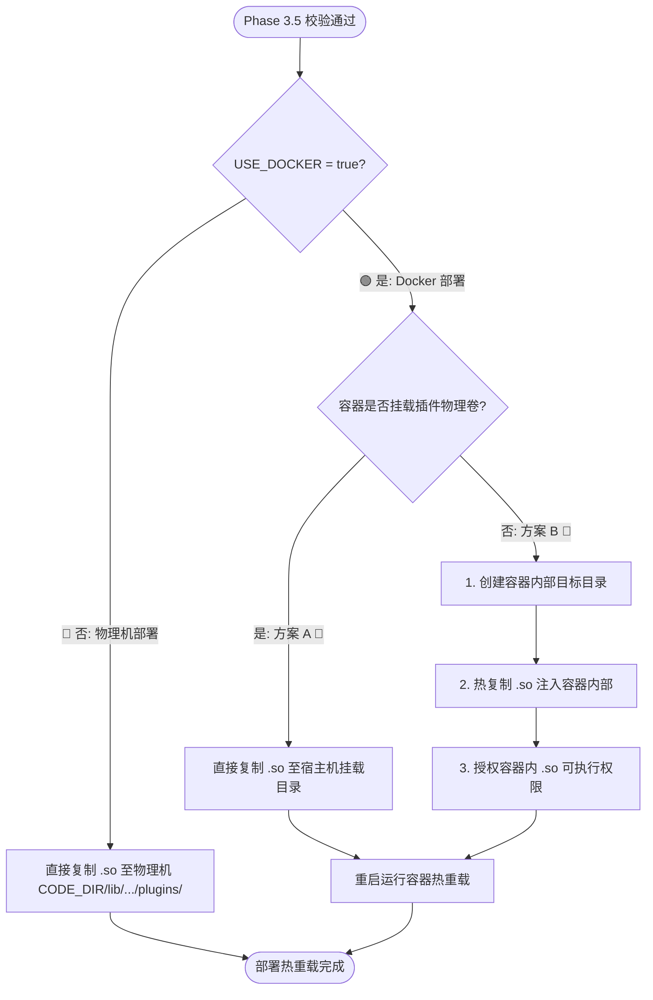

# Phase 4: 物理分发与容器热重载

只有当 Phase 3.5 校验通过后，才允许分发 `.so` 插件。根据环境变量 `USE_DOCKER` 进行第一级分流：

---

## 🗺️ 双模部署决策流



---

## 💻 分支一：部署至物理机 (USE_DOCKER=false)
* **分发命令**：直接把本地（或交叉编译出）的 `.so` 复制到目标宿主机的物理插件路径下，无需重启容器：
  ```bash
  cp cpp/build/lib/*.so ${CODE_DIR}/lib/du/flowgraph/plugins/
  ```

---

## 🐳 分支二：部署至 Docker 容器 (USE_DOCKER=true)

根据目标容器的挂载情况选择：

### 📌 方案 A：挂载直推覆盖 (宿主机已挂载插件物理卷)
* **分发命令**：直接拷贝到挂载的宿主机路径下并重启容器：
  ```bash
  cp cpp/build_cross/lib/*.so ${CODE_DIR}/lib/du/flowgraph/plugins/
  docker restart ${DOCKER_NAME}
  ```

### 📌 方案 B：docker cp 热拷贝 (无物理卷挂载)
* **分发命令**：利用 `docker cp` 热拷贝进容器，授权并重启：
  ```bash
  # 1. 确保容器内部目标目录存在
  docker exec ${DOCKER_NAME} mkdir -p /workspace/lib/du/flowgraph/plugins/
  # 2. 将 so 文件热拷贝注入容器
  docker cp cpp/build_cross/lib/. ${DOCKER_NAME}:/workspace/lib/du/flowgraph/plugins/
  # 3. 授权容器内插件可执行权限
  docker exec ${DOCKER_NAME} chmod +x /workspace/lib/du/flowgraph/plugins/*.so
  # 4. 重启容器
  docker restart ${DOCKER_NAME}
  ```

---

## 🚀 自动化覆盖部署与热重启脚本

在项目专属运维技能包中，我们预置了自动化分发与热重启脚本。您可以在项目根目录下通过相对路径直接调用：
* **脚本路径**：[.agents/skills/cpp_algorithm_ops/scripts/deploy.sh](../scripts/deploy.sh)
* **调用指令**：
  ```bash
  bash .agents/skills/cpp_algorithm_ops/scripts/deploy.sh
  ```
* **自动化行为**：自动检索本地 `cpp/build_cross/lib/` 下的交叉编译 `.so` 产物，自动读取本地专属 `.env` 配置，优先判定 `USE_DOCKER`（物理机或容器分流）。在容器部署下，通过 `docker inspect` 自动检查容器挂载属性，跨网络 SCP 自动执行方案 A（宿主机挂载直推）或方案 B（`docker cp` 注入、可执行授权），最后重启目标容器以热重载 `.so`。
