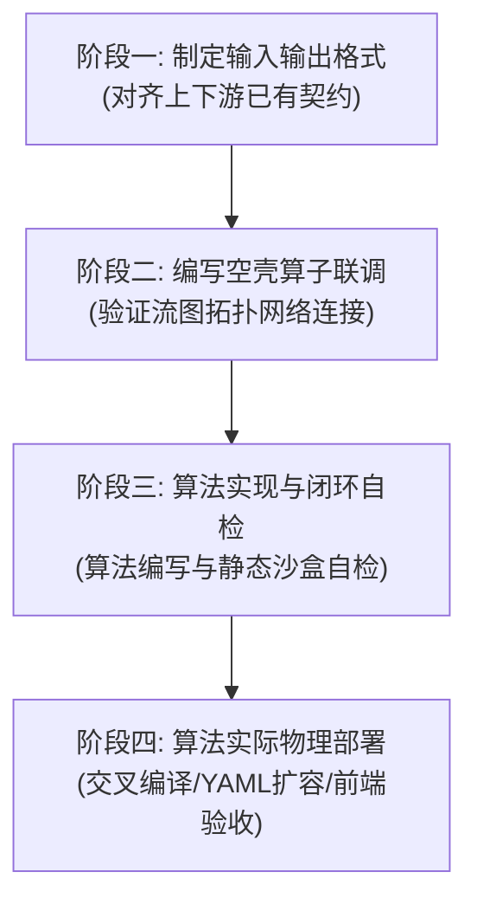

# Cycore Flowgraph 算子开发指南

> [!IMPORTANT]
> **与 CyCore 的开发依赖关系**：
> 本独立算法库（uestcradar）在开发 C++ 算子 Wrapper 接口时，依赖于 `cycore` 流图引擎的 SDK（例如 Flowgraph 的 Block、Port、Buffer 核心头文件）。在开发和编译过程中如果遇到相关的编译报错（如找不到核心类或 ABI 接口不兼容），请检查并确认开发环境上的 `cycore` SDK 头文件与库文件是否已更新同步至最新版本。

## 💡 核心开发工作流 (必须严格按阶段顺序执行)

### 📂 阶段一：制定数据格式 (I/O Specification)

1. **类型复用**：include `<common/data_types.h>` 强制复用 `cy::common::CS16` 或 `CF32` 等已有类型。
2. **维度动态化**：维度使用 `kDefault*` 声明默认值，必须在构造函数中从 `Params` 动态提取，禁止在算法中写死。
   *详细规范请参阅子指南：[2. 输入输出数据格式制定规范](references/data-format-specification.md)*

### 📂 阶段二：空壳算子全系统联调 (Skeleton Integration)

1. **直通联调逻辑**：
   * **输入输出格式相同**：将 `work` 函数写成直通（Pass-through）逻辑（如用 `std::memcpy` 零拷贝直通），将输入数据无损复制到输出。
   * **输入输出格式不同**：根据输出的格式契约，将输入数据在 work 中进行最基础的格式转换映射（如只取实部转换或填充特征常量值），形式化地满足输出类型。
2. **联调与波形观察**：
   * 将空壳插件编译并部署到目标物理机，启动流图，**在前端 cyweb 订阅对应的 Probe 探针，直接观察波形，验证系统链路是否 100% 连通（包括拓扑连接、网络通道打流以及前端解析渲染）**。
   * **核心价值**：通过空壳直通将系统架构级错误与复杂的数学算法错误彻底隔离。系统全链路调试畅通并观察到波形前，严禁开发核心算法。

### 📂 阶段三: 算法实现与闭环自检 (Implementation & Verification)

1. **算法编写**：在骨架验证通过后，锁定 Reader/Writer 物理窗口进行零拷贝原地计算，使用 Stride 跨步直接寻址。
2. **沙盒自检**：在测试主程序中直接实例化静态测试 Block（`SimSource` / `SimSink`）组成仿真流图，对输出结果进行严苛的 Epsilon 理论精度与通道隔离度 assert断言。
   *详细模板与自检规范请参阅子指南：[3. 算法实现与自检规范](references/algorithm-implementation.md)*

### 📂 阶段四：算法实际物理部署 (Actual Deployment)

1. **极简交叉编译**：在本地基于 Skill 预置的极简编译镜像一键交叉生成目标异构架构的 `.so` 动态库。
2. **连接线容量扩容**：在目标机 YAML 的 `connections` 中将 `capacity`，以及 `probes` 中的 `frame_size` 扩容为单次 Cube 读取量的整数倍，防止环形缓冲区容量不足发生死锁。
3. **前端最终验收**：热注入部署并重启物理机容器，确保心跳建立，在前端 `cyweb` 上下发并订阅波形完成大闭环验收。
   *编译与热部署详细流程请参阅子指南：[4. 编译指南](references/compilation-guide.md) 和 [5. 容器部署指南](references/deployment-guide.md)*

---

## 📚 详细子指南引用 (开发到对应阶段时查看)

请根据需要利用 `view_file` 阅读以下详细开发参考文献：

* [1. 模板目录结构与修改范围](references/template-structure.md)
  * **前期准备**：熟悉开发脚手架 and 修改范围。
* [2. 输入输出数据格式制定规范](references/data-format-specification.md)
  * 执行阶段一（制定格式）时阅读，学习 C++ 类型复用与平坦化规约。
* [3. 算法实现与自检规范](references/algorithm-implementation.md)
  * 执行阶段三（编写与自检）时阅读，学习 Stride 跨步交织寻址、`read_cube` 读写锁定以及静态自检沙盒。
* [4. 编译指南](references/compilation-guide.md)
  * 执行阶段三/四（编译构建）时阅读，学习本地同构编译、极简 Dockerfile 交叉编译以及跨架构 dlopen 报错避坑红线。
* [5. 容器部署指南](references/deployment-guide.md)
  * 执行阶段二/四（部署运行）时阅读，学习物理机/容器热注入部署与 KeepAlive 心跳校验。
