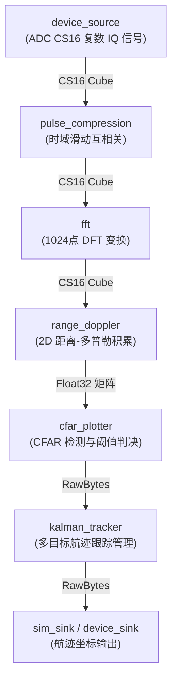

# UESTC 雷达信号处理平台 (uestcradar)

本项目是一个结合了 **MATLAB 原型算法仿真** 与 **C++ 高性能流图算法** 的混合雷达信号处理开发平台，用于实现实时的雷达数字信号处理流水线。

---

## 目录架构

```text
uestcradar/
├── matlab/                       # MATLAB 仿真与算法验证（核心入口）
│   ├── README.md                 # MATLAB 专属使用指南
│   ├── algorithm/                # 基础算法 M 函数 (PC, CFAR 等)
│   ├── radar_gui.m               # 交互式雷达目标回波 GUI 仿真器
│   ├── lfm_tx.m                  # LFM 发射信号生成仿真
│   └── parse_bin.m               # 二进制雷达抓取 Cube 数据解析与校准
├── cpp/                          # C++ Cycore 流图算子插件源码
│   ├── CMakeLists.txt            # CMake 编译定义
│   ├── sdk/                      # 依赖的 Cycore 算法 SDK 头文件
│   ├── pulse_compression/        # 时域滑动互相关匹配滤波算子
│   ├── fft/                      # FFT (时域 -> 频域离散傅里叶变换)
│   ├── ifft/                     # IFFT (频域 -> 时域逆离散傅里叶变换)
│   ├── range_doppler/            # 2D 距离-多普勒积累算子
│   ├── cfar_plotter/             # 恒虚警（CFAR）目标检测算子
│   └── kalman_tracker/           # 卡尔曼滤波航迹跟踪器
├── algorithm_template/           # C++ 新算子开发通用模板脚手架
│   └── README.md                 # 模板使用与编译自检指南
├── workspace/                    # 可独立构建的容器迁移示例源码
│   ├── helloworld/               # 标准 C++ 持续运行示例
│   └── qt5core/                  # Qt 5.15 + qmake + Qt Core 示例
├── docker/                       # 跨架构镜像构建与部署入口
│   ├── helloworld/               # 标准 C++ 的 Compose、脚本与指南
│   ├── qt5core/                  # Qt 5.15 的 Compose 与指南
│   └── README.md                 # Docker 示例索引
└── LICENSE                       # 项目授权协议
```

---

## MATLAB 仿真工具箱 (MATLAB 部分)

`matlab` 目录提供了完整的 Range-Doppler（距离-多普勒）二维处理流程和雷达回波仿真分析工具。

### 1. 核心功能特性

* **交互式 GUI 动态分析仪 (`radar_gui.m`)**：
  提供一站式图形用户面板。支持加载 TX/RX 二进制回波数据，动态调整 DSP 参数（如 FFT 变换点数、MTI 强度、CFAR 判决门限），实时渲染播放四宫格 Range-Doppler 谱图及切片对比线，并支持将回放过程一键导出为 GIF 动图。
* **自适应距离零点标定算法 (`calibrate_range_zero.m`)**：
  利用发射与接收通道间的互相关峰值捕获直达波（Leakage）信号，自动标定绝对距离的零点，消除物理线缆和硬件传输链路带来的时延。
* **静止杂波抑制（MTI 算子库）**：
  提供了复均值相减（`mti_avg.m`）和双脉冲对消（`mti_two_pulse.m`）两种经典的动目标指示算法，有效抑制地杂波并突出运动目标。
* **元数据驱动机制**：
  支持直接读取并解析多通道 `CS16` 格式交错二进制数据。雷达射频参数、PRI、频段及通道数等均由所在目录的 `metadata.json` 自动加载解析，无需硬编码。

> [!TIP]
> 📖 关于 MATLAB 工具箱的依赖安装、详细数据包下载准备以及 GUI 运行步骤指南，请参阅：
> **[MATLAB 子目录专属说明文档 (matlab/README.md)](matlab/README.md)**

---

## C++ 算子插件 (C++ 部分)

C++ 算子插件通过 YAML 流图配置文件进行动态拓扑连接。新算法使用 Cycore SDK
帧级接口：流图边统一传输 `std::byte`，SDK 负责拆帧、精确长度校验、固定 POD
或 `header + std::vector payload` 的自动编解码、元数据透传和输出封包，算法
`work()` 只处理完整的强类型 `InputData` / `OutputData`。算法无需编写 Codec。
仓库仍保留部分待迁移的旧
`Reader` / `Writer` 算子。

### 1. 级联流水线拓扑

以下为标准的级联处理流水线：


```mermaid
graph TD
    A["device_source<br/>(ADC CS16 复数 IQ 信号)"] -->|CS16 Cube| B["pulse_compression<br/>(时域滑动互相关)"]
    B -->|CS16 Cube| C["fft<br/>(1024点 DFT 变换)"]
    C -->|CS16 Cube| D["range_doppler<br/>(2D 距离-多普勒积累)"]
    D -->|Float32 矩阵| E["cfar_plotter<br/>(CFAR 检测与阈值判决)"]
    E -->|RawBytes| F["kalman_tracker<br/>(多目标航迹跟踪管理)"]
    F -->|RawBytes| G["sim_sink / device_sink<br/>(航迹坐标输出)"]
```

> [!NOTE]
> 流水线中的所有算子均采用多通道交织一维物理连续内存格式传输数据，其跨步步长（Stride）可根据算子配置参数（如 channels, points）动态对齐。

### 2. 支持的算子模块列表

* **`pulse_compression`**：时域滑动互相关匹配滤波算法，在 C++ 层面实现了复数共轭乘加与快速时域归一化幅值包络提取。
* **`fft` / `ifft`**：高性能时/频域离散傅里叶变换与逆变换算子。
* **`range_doppler`**：2D 距离-多普勒相干/非相干积累。
* **`cfar_plotter`**：恒虚警检测（CFAR）滑动窗口背景噪声估计与动态判决。
* **`kalman_tracker`**：多目标航迹状态卡尔曼滤波与关联管理。

### 3. C++ 新算子开发模板 (algorithm_template)

为了便于开发者快速构建、本地调试及跨平台容器化编译全新的 C++ 雷达流图算子，
仓库内置了变长帧级模板，并兼容固定 POD。模板携带由 `cpp/sdk/include` 生成的稳定 SDK 快照，支持
独立编译，算法开发者不应修改该快照。
副本，并集成完整帧 QA 与 `CYCORE_REGISTER_BENCHMARK` 一键性能基线。

> [!IMPORTANT]
> 📖 关于如何基于脚手架模板克隆新算法、制定数据格式、执行本地静态自检沙盒测试以及进行 AArch64 容器化交叉编译，请参阅：
> **[C++ 算子开发模板专属指南 (algorithm_template/README.md)](.agents/skills/develop_cpp_algorithm/algorithm_template/README.md)**

## 算法开发基座 (单机测试环境)

在 `workspace/examples/` 目录下提供了单机测试黑盒环境（内置测试数据源与结果自动校验）。算法开发者在本地一键启动测试环境后，即可专心编写 C++ / Qt 算法代码，无需关心底层传输细节。

### 算法开发指南

| 算法开发基座 | 适用场景 | 说明文档 (相对路径) |
| :--- | :--- | :--- |
| **`pulsecompression`** | C++ 一维匹配滤波 / 脉冲压缩算法开发 | **[脉冲压缩算法开发指南](workspace/examples/pulsecompression/README.md)** |
| **`qt5-algorithm`** | Qt5 框架下二维距离-多普勒 (RDMap) 算法开发 | **[Qt5 RD 图算法开发指南](workspace/examples/qt5-algorithm/README.md)** |

> [!TIP]
> 📖 关于各种雷达数据帧（IQ 数据、脉脉冲压缩数据、RD 图）的具体字段含义和读取方法，请参阅：
> **[SDK 数据读写指南](workspace/sdk/README.md)**
