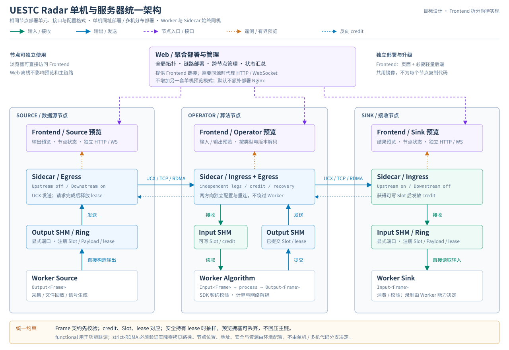
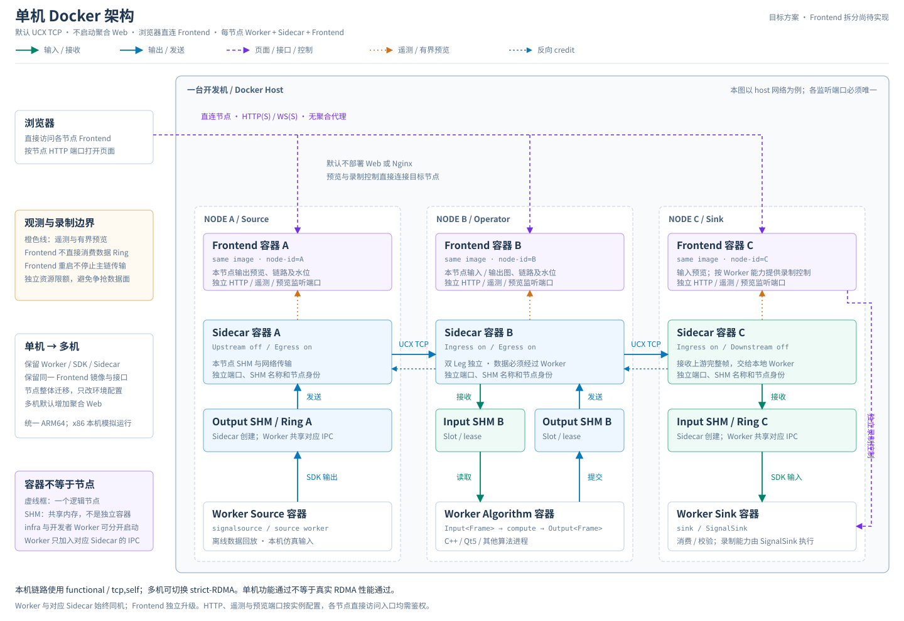
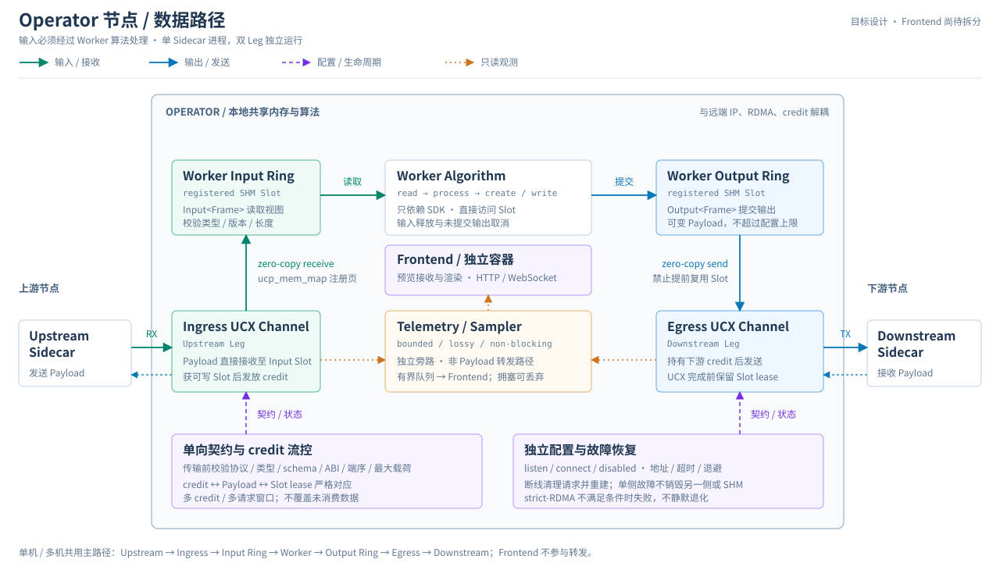

# UESTC Radar 目标架构

建设分布式、载荷无关、算子解耦、主数据面零拷贝的雷达流式处理框架，支持采集、脉压、波束形成、RD、CFAR 等算法。本文描述目标与验收要求，不代表全部能力已实现。

## 1. 总体架构



[打开完整架构图](.diagrams/target-architecture.svg)

| 层级 | 职责 | 边界 |
|---|---|---|
| Worker | 业务计算，通过 SDK 读写 Frame | 不处理 UCX、RDMA、网络地址、重连或背压实现 |
| Sidecar | 连接本地 SHM 与远端 UCX/RDMA，维护传输和 credit | 只理解通用帧头、长度和契约，不解析业务载荷 |
| Frontend | 本节点遥测、预览接收、帧解码、页面渲染与必要的 HTTP/WebSocket 接口 | 独立容器，可直接访问；不依赖聚合 Web，不直接消费数据 Ring |
| Web | 全局拓扑、链路部署、跨节点管理、状态汇总与 Frontend 入口聚合 | 保留现有聚合控制台定位，不增加另一套“单机预览模式” |
| Telemetry / Sampler | 上报状态，在安全持有 lease 时有界抽样 | Sidecar 旁路模块，不是独立 Ring 消费者；慢接收方不得回压主数据面 |

Worker 可跨进程、容器和物理机组成任意长度的有向处理链；通过显式 SHM 端口连接 Sidecar，不依赖固定容器名称。

### 单机与多机统一部署（目标方案）



[打开完整单机架构图](.diagrams/single-host-docker.svg)

上方总图展示统一架构，本图仅展示**单机默认部署**：使用 UCX TCP，不启动聚合 Web，由浏览器直接访问各节点 Frontend。

固定节点部署单元为 **Worker + Sidecar + Frontend**。三者是独立容器，Worker 与对应 Sidecar 共享本机 IPC；Frontend 通过网络接口接收遥测和有界预览，不挂载数据 Ring。图中从上到下排列 Frontend、Sidecar、SHM、Worker；位置表示职责分层，箭头表示实际读写方向。

**两套默认配置，一套软件架构。** 单机默认使用 UCX TCP，不启动聚合 Web；多机默认使用 strict-RDMA，并启动聚合 Web。两者共用镜像职责、接口、节点启动流程和配置格式，不维护两套应用。这里的“多机”指跨多台服务器部署；全部模块放在一台服务器上仍属于单机部署。

| 配置项 | 单机部署 | 多机部署 |
|---|---|---|
| 节点放置 | 多个节点放在同一台机器 | 节点单元分配到不同服务器；Worker 与对应 Sidecar 必须同机 |
| Web 与 Frontend | 默认不启动 Web，直接访问各节点 Frontend | 默认启动一个聚合 Web 管理分布式节点，各节点保留独立 Frontend |
| 身份与端口 | 节点 ID 唯一；同机 SHM 名称、监听端口不冲突 | 节点 ID 全局唯一；按各宿主机配置 SHM 名称、地址和端口 |
| 传输 | 默认 UCX functional / tcp,self | 默认 UCX strict-RDMA，启动前验证设备、驱动、网络与资源条件 |
| 镜像与资源 | 全程使用 linux/arm64 镜像；x86 本机通过 ARM64 模拟运行，配置资源限额 | 同一套 linux/arm64 镜像在 ARM 服务器原生运行，按硬件配置网卡、memlock、CPU/NUMA 等 |
| 访问与安全 | 本地或聚合入口均需鉴权 | 额外明确跨主机可达地址、TLS、凭据与防火墙规则 |

Frontend 支持直接访问和按节点独立升级、回滚。默认复用同一镜像，通过版本和配置区分节点，不为每个节点复制代码。聚合 Web 提供节点链接；需要同源访问时代理 Frontend 的 HTTP/WebSocket，不重复实现节点渲染。**不额外设置默认 Nginx 容器**；如确有 TLS 终止等需求，反向代理作为两种部署共用的可选设施。

默认配置不是硬性绑定，允许以下显式覆盖：

- **单机启用 Web**：需要测试完整编排或集中管理时，启动与多机相同的聚合 Web，不新增“单机版 Web”。
- **多机使用 TCP**：不具备 RDMA 条件或进行功能联调时，可主动选择 functional / tcp,self；一旦选择 strict-RDMA，校验失败必须停止，禁止自动或静默降级为 TCP。

Frontend 是带必要轻量后端的节点预览应用，不只是静态文件服务器。两种部署下均可直接访问 Frontend；Web 未启动或离线不影响节点预览与主数据链。

构建与发布沿用现有 [Web](infra/web/docker/README.md)、[Sidecar](infra/sidecar/docker/README.md) 的 ARM64 基座及受控发布流程，验收部署优先从 Harbor 拉取固定 digest，不在部署现场临时构建。集成验收入口为 `192.162.2.64` 上的 Web：通过该控制台部署各服务器 Docker 链路并展示嵌入的 Frontend，Web 所在主机不等于全部 Worker 的部署位置。

以上为目标方案：现有 `infra/web` 保留聚合部署与管理职责；计划从中抽取可复用的图表、帧解析和预览接收代码，形成独立 Frontend 镜像。**此次仅更新架构图文，尚未实现 Frontend 拆分、发布或通用录制控制。**

## 2. Frame 与 SDK

- 通用 Envelope 包含 `frame_id`、`timestamp`、`type_id`、`type_version`、`schema_id`、`payload_length`；可扩展 flags、trace ID 和校验信息。
- Payload 是连续二进制区域，支持端口配置上限内的变长帧；超限明确拒绝，不截断、不覆盖。
- 同时支持 `RawFrame`、IQ/PC/RD 等强类型零拷贝视图和外部自定义 Codec/Schema。
- SDK 负责端口发现、Frame lease、类型/版本/长度/维度校验、空满环等待、未提交输出取消和输入释放；支持自旋、事件通知或混合等待。

目标接口示意：

```cpp
Input<Frame> input("input-port");
Output<Frame> output("output-port");
for (;;) {
    auto in = input.read();
    auto out = output.create(metadata, payload_size);
    process(in, out);
    output.write(out);
}
```

## 3. Sidecar 数据路径



[打开完整数据路径图](.diagrams/operator-dataflow.svg)

### 双 Leg 与角色

单进程拥有独立的 Upstream/Ingress 和 Downstream/Egress Leg，各自配置启停、listen/connect、地址端口、超时退避、functional/strict-RDMA 路径及帧契约。两方向的生命周期、状态、错误和重连独立，单侧断线不得无条件销毁另一侧、SHM 或遥测。

| 角色 | Upstream | Downstream | Worker 行为 |
|---|---|---|---|
| Source | 禁用 | 启用 | 产生数据 |
| Operator | 启用 | 启用 | 消费、计算、输出 |
| Sink | 启用 | 禁用 | 消费最终结果 |

默认不绕过 Worker 直接转发；纯 Relay 必须是显式独立模式。

### 零拷贝、流控与契约

- Worker 直接读写 SHM Slot；Sidecar 使用经 `ucp_mem_map` 注册的 Slot 地址收发，UCX 请求完成前不得释放或复用 lease。
- 大块 Payload 不经过额外中转复制；允许少量帧头/Metadata 复制及旁路有界抽样复制。
- 接收方获得可写 Slot 后发放 credit，发送方持有 credit 才发送；credit、Payload、lease 严格对应，支持可配置的多 credit/多请求窗口。
- 传输前校验协议版本、类型/版本/schema、最大 Payload、必要 ABI、端序和能力标志；不匹配明确拒绝并告警。
- strict-RDMA 必须验证实际 RC 与零拷贝 Rendezvous 路径；设备、驱动、memlock 或路由不满足时失败，不静默降级。
- 断线后清理或重建相关请求、endpoint 和内存注册，自动恢复通道；统计 credit、Ring、网络等待与在途请求。

## 4. 可视化与控制

Frontend 负责节点级展示与预览，Web 负责全局状态汇总、部署和管理。共用预览协议与渲染模块，不把集群编排、SSH 凭据或部署权限带入 Frontend。

- **链路与拓扑**：按真实遥测生成拓扑，展示两方向状态（禁用、监听、连接中、已连接、重试、降级、失败）、节点与地址、连接角色、实际 transport/设备/路径、连接与断线时间、重试和错误、RTT、吞吐、消息率及在途请求。
- **Ring 与告警**：展示容量、已用/可用 Slot、读写位置、水位历史、生产消费速率、空满环等待、背压次数与时长；支持阈值及持续时间规则，记录离线、shutdown、契约错误、消费者停滞和恢复事件。
- **预览**：安全持有 lease 时抽样，送入独立、有界、可丢弃队列；按类型/版本/schema 解码，通过二进制 WebSocket 等方式显示波形、频谱、热力图、点云和表格。禁止将 Sampler 作为不安全的第二个 Ring 消费者。
- **控制**：支持查询配置/版本、调整抽样与告警参数、启停采样任务及下发经校验的运行参数；必须认证、授权、审计和支持失败回滚，不阻塞主数据面。节点录制能力由 SignalSink 等 Worker 实现；Frontend 仅在 Worker 支持时提供独立控制接口，不通过预览流代替原始数据录制。

## 5. 部署与生命周期

- Sidecar 可先于 Worker 启动，创建 SHM、上报遥测并建立连接；Worker 随后接入，可独立停止、重启或升级。
- Web 或 Frontend 停止、浏览器断开、预览队列拥塞均不得阻塞主链路；旁路有界、可丢弃并限制 CPU/内存/带宽。遥测或预览发送失败不得触发数据 Leg 重启，网络短暂断开不要求重启整条链。
- Frontend 可独立启动、重连、升级和回滚，不要求重启 Worker、Sidecar 或 Web；同一协议需明确版本兼容性，不能因前端版本独立就跳过契约校验。
- Sidecar 重启需明确 SHM 所有权和代际，避免旧 Worker 与新 Ring 分裂；同机多实例使用独立端口与 SHM 名称。
- 优先复用同一份节点 Compose 定义与环境配置结构，以部署配置选择传输模式和是否启动 Web：单机默认 TCP、无 Web；多机默认 strict-RDMA、有 Web。单机在本机实例化节点，多机在各主机实例化；Compose 本身不负责跨主机调度，由部署层安排节点位置。Web 和 Frontend 均不要求挂载 Docker Socket。
- 目标支持健康检查、资源限制、CPU/NUMA 绑定、必要的 Huge Page 优化和优雅退出；未来使用 Kubernetes 时保持相同模块职责和接口，不另做一套应用。
