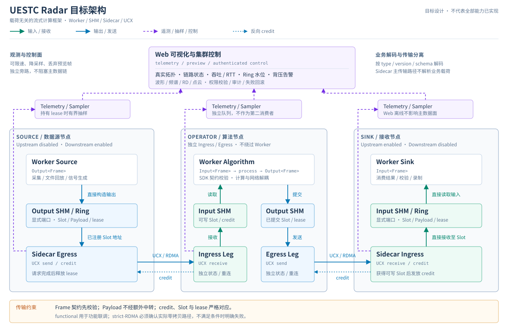
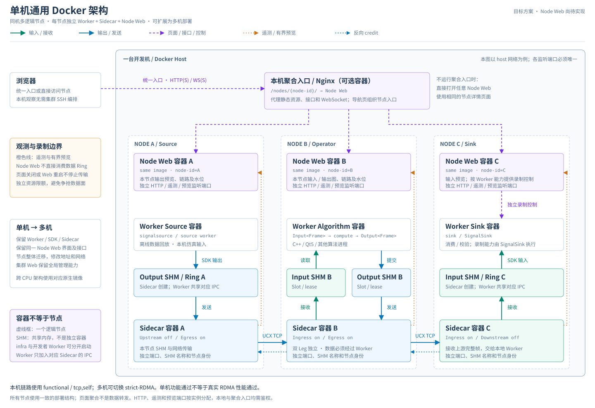
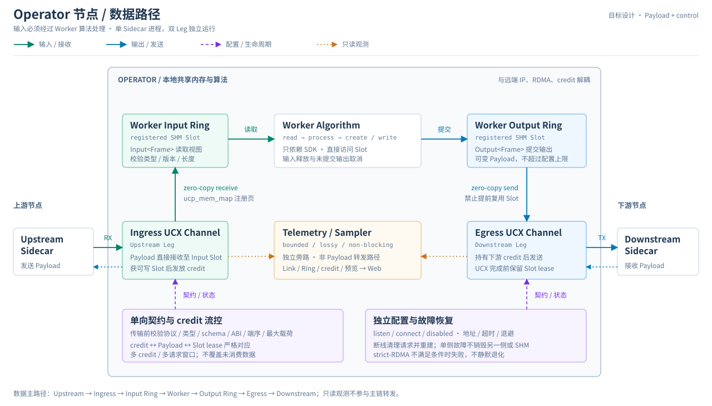

# UESTC Radar 目标架构

建设分布式、载荷无关、算子解耦、主数据面零拷贝的雷达流式处理框架，支持采集、脉压、波束形成、RD、CFAR 等算法。本文描述目标与验收要求，不代表全部能力已实现。

## 1. 总体架构



[打开完整架构图](diagrams/target-architecture.svg)

| 层级 | 职责 | 边界 |
|---|---|---|
| Worker | 业务计算，通过 SDK 读写 Frame | 不处理 UCX、RDMA、网络地址、重连或背压实现 |
| Sidecar | 连接本地 SHM 与远端 UCX/RDMA，维护传输和 credit | 只理解通用帧头、长度和契约，不解析业务载荷 |
| Web / Sampler | 遥测、拓扑、告警、抽样展示与控制 | 独立旁路，故障或慢浏览器不得回压主数据面 |

Worker 可跨进程、容器和物理机组成任意长度的有向处理链；通过显式 SHM 端口连接 Sidecar，不依赖固定容器名称。

### 单机通用 Docker 部署（目标方案）



[打开完整单机架构图](diagrams/single-host-docker.svg)

与上图相比，这里展开同机容器关系，并补充拟新增的节点 Web：每个逻辑节点由 Worker、Sidecar、Node Web 组成。Worker 与对应 Sidecar 共享 IPC；Node Web 通过遥测与预览接口观察节点，不直接消费数据 Ring。可直接访问节点页面，也可通过可选的 Nginx 入口聚合。

单机运行多个相同部署单元，分别分配节点 ID、SHM 名称及数据、HTTP、遥测、预览端口；多机部署只改变节点位置和环境配置，保持算法、SDK、Sidecar 与节点界面一致，镜像按 CPU 架构构建。框图为目标方案，节点 Web 和通用录制能力尚待实现。

## 2. Frame 与 SDK

- 通用 Envelope 包含 `frame_id`、`timestamp`、`type_id`、`type_version`、`schema_id`、`payload_length`；可扩展 flags、trace ID 和校验信息。
- Payload 是连续二进制区域，支持端口配置上限内的变长帧；超限明确拒绝，不截断、不覆盖。
- 同时支持 `RawFrame`、IQ/PC/RD 等强类型零拷贝视图和外部自定义 Codec/Schema。
- SDK 负责端口发现、Frame lease、类型/版本/长度/维度校验、空满环等待、未提交输出取消和输入释放；支持自旋、事件通知或混合等待。

目标接口示意：

```cpp
Input<Frame> input("input-port");
Output<Frame> output("output-port");
for (;;) {
    auto in = input.read();
    auto out = output.create(metadata, payload_size);
    process(in, out);
    output.write(out);
}
```

## 3. Sidecar 数据路径



[打开完整数据路径图](diagrams/operator-dataflow.svg)

### 双 Leg 与角色

单进程拥有独立的 Upstream/Ingress 和 Downstream/Egress Leg，各自配置启停、listen/connect、地址端口、超时退避、functional/strict-RDMA 路径及帧契约。两方向的生命周期、状态、错误和重连独立，单侧断线不得无条件销毁另一侧、SHM 或遥测。

| 角色 | Upstream | Downstream | Worker 行为 |
|---|---|---|---|
| Source | 禁用 | 启用 | 产生数据 |
| Operator | 启用 | 启用 | 消费、计算、输出 |
| Sink | 启用 | 禁用 | 消费最终结果 |

默认不绕过 Worker 直接转发；纯 Relay 必须是显式独立模式。

### 零拷贝、流控与契约

- Worker 直接读写 SHM Slot；Sidecar 使用经 `ucp_mem_map` 注册的 Slot 地址收发，UCX 请求完成前不得释放或复用 lease。
- 大块 Payload 不经过额外中转复制；允许少量帧头/Metadata 复制及旁路有界抽样复制。
- 接收方获得可写 Slot 后发放 credit，发送方持有 credit 才发送；credit、Payload、lease 严格对应，支持可配置的多 credit/多请求窗口。
- 传输前校验协议版本、类型/版本/schema、最大 Payload、必要 ABI、端序和能力标志；不匹配明确拒绝并告警。
- strict-RDMA 必须验证实际 RC 与零拷贝 Rendezvous 路径；设备、驱动、memlock 或路由不满足时失败，不静默降级。
- 断线后清理或重建相关请求、endpoint 和内存注册，自动恢复通道；统计 credit、Ring、网络等待与在途请求。

## 4. 可视化与控制

- **链路与拓扑**：按真实遥测生成拓扑，展示两方向状态（禁用、监听、连接中、已连接、重试、降级、失败）、节点与地址、连接角色、实际 transport/设备/路径、连接与断线时间、重试和错误、RTT、吞吐、消息率及在途请求。
- **Ring 与告警**：展示容量、已用/可用 Slot、读写位置、水位历史、生产消费速率、空满环等待、背压次数与时长；支持阈值及持续时间规则，记录离线、shutdown、契约错误、消费者停滞和恢复事件。
- **预览**：安全持有 lease 时抽样，送入独立、有界、可丢弃队列；按类型/版本/schema 解码，通过二进制 WebSocket 等方式显示波形、频谱、热力图、点云和表格。禁止将 Sampler 作为不安全的第二个 Ring 消费者。
- **控制**：支持查询配置/版本、调整抽样与告警参数、启停采样任务及下发经校验的运行参数；必须认证、授权、审计和支持失败回滚，不阻塞主数据面。

## 5. 部署与生命周期

- Sidecar 可先于 Worker 启动，创建 SHM、上报遥测并建立连接；Worker 随后接入，可独立停止、重启或升级。
- Web/Sampler 离线不影响主链路；网络短暂断开不要求重启整条链。
- Sidecar 重启需明确 SHM 所有权和代际，避免旧 Worker 与新 Ring 分裂；同机多实例使用独立端口与 SHM 名称。
- 目标支持 Compose/Kubernetes、健康检查、资源限制、CPU/NUMA 绑定、必要的 Huge Page 优化和优雅退出。
