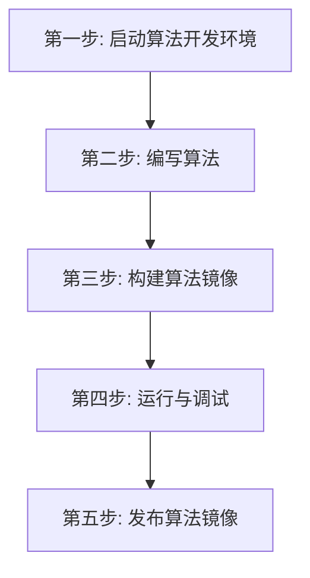

# UESTC Radar - IQ 脉冲压缩算法开发模板

本目录是标准 C++ 雷达算法开发模板，演示一条连续的 **IQ 数据 → 脉冲压缩数据**
处理流。运行后会持续打印输入输出尺寸和峰值位置，便于确认算法正在工作。

## 开发全流程概览



## 第一步：启动算法开发环境

在本目录执行一条命令：

```bash
docker-compose -f docker-compose.infra.yaml up -d --no-build
```

启动后，连续 IQ 测试数据已准备好。

## 第二步：编写算法

算法入口位于 `src/main.cpp`，数学实现位于 `src/my_algorithm.hpp`。SDK 的完整处理
流程只有读取、创建、计算和写出四步：

```cpp
#include <data.h>
#include "my_algorithm.hpp"

using namespace uestcradar;

Input<IQFrame> input;
Output<PulseCompressionFrame> output;

while (true) {
    // 1. 读取 IQ 数据。
    auto iq = input.read();
    auto iq_metadata = iq.metadata();

    // 2. 填写本算法输出数据的业务参数。
    PulseCompressionMetadata metadata{
        .channel_count = iq_metadata.channel_count,
        .range_bin_count = iq_metadata.samples_per_channel,
        .pulse_index = 0,
        .pulses_per_cpi = 8,
        .range_resolution_m = 1.5,
    };
    // 一帧 IQ 生成一帧脉压结果时，这里传当前正在处理的 IQ 帧。
    auto pulse = output.create(metadata, iq);

    // 3. 执行算法。
    auto result = pulse_compress(iq.data(), pulse.data());
    std::cout << "peak_range_bin=" << result.peak_range_bin << '\n';

    // 4. 写出结果。
    output.write(std::move(pulse));
}
```

开发自己的算法时，主要替换 `src/my_algorithm.hpp` 中 `pulse_compress()` 的函数体。
输入和输出都是可直接按行访问的二维数组。

## 第三步：构建算法镜像

```bash
docker build --pull -t my-radar-algorithm:dev .
```

## 第四步：运行与调试

```bash
export ALGORITHM_IMAGE=my-radar-algorithm:dev
docker-compose -f docker-compose.infra.yaml up -d --no-build algorithm
docker-compose -f docker-compose.infra.yaml logs -f algorithm pulse-sink
```

正常日志示例：

```text
[algorithm] IQ -> pulse compression ready frames=0
[algorithm] processed=20 iq=1x128 pulse=1x128 peak_range_bin=0
[sink] type=pulse received=20 shape=1x128 peak_range_bin=0
```

进入容器交互调试：

```bash
docker-compose -f docker-compose.infra.yaml run --rm --no-deps \
  --entrypoint /bin/bash algorithm
/app/algorithm --log-every 1
```

停止环境：

```bash
docker-compose -f docker-compose.infra.yaml down
```

## 第五步：发布算法镜像

```bash
docker tag my-radar-algorithm:dev \
  registry.chengyistudio.com/cxx/my-radar-algorithm:v1.0.0
docker login registry.chengyistudio.com
docker push registry.chengyistudio.com/cxx/my-radar-algorithm:v1.0.0
```
