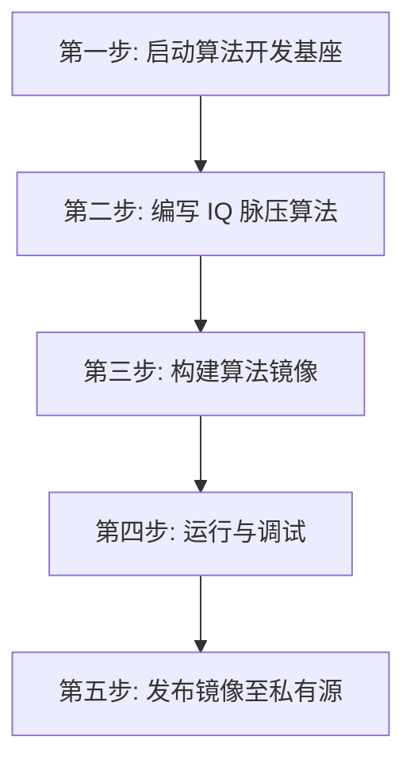

# UESTC Radar - IQ 脉冲压缩算法开发模板

欢迎！本目录是雷达**算法工程师**使用标准 C++ 开发算法的入门模板。

示例会持续产生 IQ 数据，调用您的算法生成脉冲压缩结果，并在终端打印帧号、数据
尺寸和峰值位置。您只需要关注 `main.cpp` 中的数据读写流程，以及
`my_algorithm.hpp` 中的数学实现。

## 开发全流程概览



## 第一步：一键启动算法开发基座

在本目录执行：

```bash
docker-compose -f docker-compose.infra.yaml up -d --no-build
```

启动完成后，测试 IQ 数据已经准备好，等待您的算法读取。

## 第二步：编写 IQ 脉压算法

SDK 提供 `Input<RawFrame>` 和 `Output<RawFrame>`；`data.h` 提供 IQ 与脉冲压缩
数据的安全访问接口。

主程序位于 `src/main.cpp`，核心流程如下：

```cpp
#include <data.h>
#include "my_algorithm.hpp"

using namespace uestcradar;

Input<RawFrame> input;
Output<RawFrame> output;

while (true) {
    // 1. 读取一帧 IQ 数据。
    RawFrame input_frame = input.read();
    auto iq = IQFrameView::from(input_frame);

    // 2. 创建一帧脉冲压缩输出。
    auto metadata = make_metadata(
        iq, input_frame.envelope().frame_id);

    RawFrame output_frame = output.create({
        .frame_id = input_frame.envelope().frame_id,
        .timestamp = input_frame.envelope().timestamp,
        .type_id = PulseCompressionFrameView::type_id,
        .type_version = PulseCompressionFrameView::type_version,
        .payload_length = static_cast<std::uint32_t>(
            PulseCompressionFrameView::payload_bytes(metadata)),
    });
    auto pulse = PulseCompressionFrameView::initialize(
        output_frame, metadata);

    // 3. 执行您的算法。
    auto result = pulse_compress(iq.data(), pulse.data());
    std::cout << "peak_range_bin=" << result.peak_range_bin << '\n';

    // 4. 提交计算结果。
    output.write(std::move(output_frame));
}
```

开发自己的算法时，主要修改：

```text
src/my_algorithm.hpp
```

当前示例使用一个简单的匹配滤波实现。您可以直接替换 `pulse_compress()` 的函数体，
输入是 IQ 二维矩阵，输出是脉冲压缩二维矩阵。

需要记住三条规则：

1. 使用 `IQFrameView::from()` 读取 IQ 数据。
2. 使用 `PulseCompressionFrameView::initialize()` 创建输出数据。
3. 使用 `output.write(std::move(output_frame))` 提交结果。

## 第三步：算法构建

在本目录执行：

```bash
docker build -t my-radar-algorithm:dev .
```

## 第四步：运行与调试

运行刚刚构建的算法：

```bash
export ALGORITHM_IMAGE=my-radar-algorithm:dev
docker-compose -f docker-compose.infra.yaml up -d --no-build algorithm
docker-compose -f docker-compose.infra.yaml logs -f algorithm pulse-sink
```

正常情况下会持续看到：

```text
[algorithm] IQ -> pulse compression ready frames=0
[algorithm] processed=20 frame=20 iq=1x128 pulse=1x128 peak_range_bin=0
[sink] type=pulse received=20 frame=20 shape=1x128 peak_range_bin=0
```

如果需要进入容器调试：

```bash
docker-compose -f docker-compose.infra.yaml run --rm --no-deps --entrypoint /bin/bash algorithm
```

进入后直接运行：

```bash
/app/algorithm --log-every 1
```

停止示例：

```bash
docker-compose -f docker-compose.infra.yaml down
```

## 第五步：发布镜像至私有源

```bash
docker tag my-radar-algorithm:dev \
  registry.chengyistudio.com/cxx/my-radar-algorithm:v1.0.0

docker login registry.chengyistudio.com
docker push registry.chengyistudio.com/cxx/my-radar-algorithm:v1.0.0
```

至此，您的 IQ 脉冲压缩算法已经完成开发、验证和发布。
