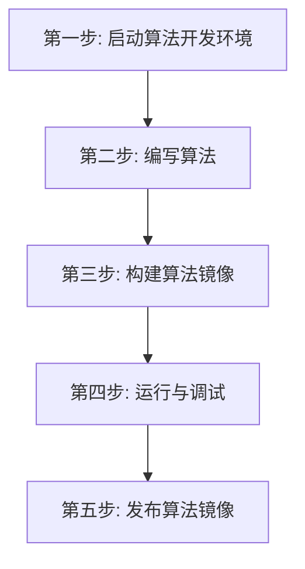

# UESTC Radar - Qt5 距离-多普勒算法开发模板

本目录是 Qt5 雷达算法开发模板，演示一条连续的 **脉冲压缩数据 → RD 图**处理流。
示例每收齐 8 个脉冲生成一张 RD 图，并持续打印矩阵尺寸和峰值位置。

## 开发全流程概览



## 第一步：启动算法开发环境

在本目录执行一条命令：

```bash
docker-compose -f docker-compose.infra.yaml up -d --no-build
```

启动后，连续脉冲压缩测试数据已准备好。

## 第二步：编写算法

算法入口位于 `src/main.cpp`，数学实现位于 `src/my_rd_algorithm.hpp`。Qt 日志与容器
生命周期不会改变 SDK 的使用方式：

```cpp
#include <data.h>
#include "my_rd_algorithm.hpp"

using namespace uestcradar;

Input<PulseCompressionFrame> input;
Output<RDFrame> output;
CpiBuffer cpi;

while (true) {
    // 1. 读取脉冲压缩数据并加入 CPI。
    auto pulse = input.read();
    auto pulse_metadata = pulse.metadata();
    cpi.push(pulse_metadata.pulse_index,
             pulse_metadata.pulses_per_cpi,
             pulse.data()[0]);

    if (!cpi.ready()) {
        continue;
    }

    // 2. 填写本算法输出数据的业务参数。
    RDMetadata metadata{
        .channel_index = 0,
        .range_bin_count = static_cast<std::uint32_t>(
            cpi.range_bin_count()),
        .doppler_bin_count = 8,
        .range_resolution_m = pulse_metadata.range_resolution_m,
        .velocity_resolution_mps = 0.5,
    };
    // 多帧合成一帧 RD 时，这里传本次 CPI 中最后读取到的脉压帧。
    auto rd = output.create(metadata, pulse);

    // 3. 执行算法并写出 RD 图。
    auto result = compute_rd(cpi, rd.data());
    qInfo() << "RD peak="
            << result.peak_range_bin
            << result.peak_doppler_bin;
    output.write(std::move(rd));
    cpi.clear();
}
```

开发自己的算法时，主要替换 `src/my_rd_algorithm.hpp` 中 `compute_rd()` 的实现。
示例只使用 QtCore，保留了最小的 `QCoreApplication` 与 `qInfo()` 日志逻辑。

## 第三步：构建算法镜像

```bash
docker build --pull -t my-radar-qt5-algorithm:dev .
```

## 第四步：运行与调试

```bash
export QT5_ALGORITHM_IMAGE=my-radar-qt5-algorithm:dev
docker-compose -f docker-compose.infra.yaml up -d --no-build qt5-algorithm
docker-compose -f docker-compose.infra.yaml logs -f qt5-algorithm rd-sink
```

正常日志示例：

```text
[qt-algorithm] pulse compression -> RD ready frames=0
[qt-algorithm] produced=1 RD=64 x 8 peak=17,2
[sink] type=rd received=1 shape=64x8 peak=17,2
```

进入容器交互调试：

```bash
docker-compose -f docker-compose.infra.yaml run --rm --no-deps \
  --entrypoint /bin/bash qt5-algorithm
/app/qt5-algorithm --log-every 1
```

停止环境：

```bash
docker-compose -f docker-compose.infra.yaml down
```

## 第五步：发布算法镜像

```bash
docker tag my-radar-qt5-algorithm:dev \
  registry.chengyistudio.com/cxx/my-radar-qt5-algorithm:v1.0.0
docker login registry.chengyistudio.com
docker push registry.chengyistudio.com/cxx/my-radar-qt5-algorithm:v1.0.0
```
