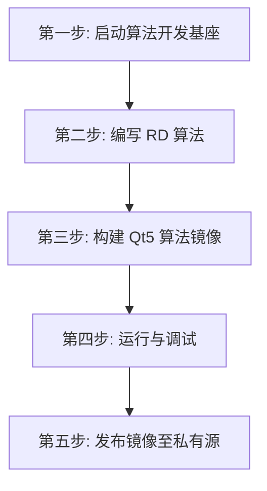

# UESTC Radar - Qt5 距离-多普勒算法开发模板

欢迎！本目录是使用 Qt5 开发雷达算法的工程师专用模板。

示例会持续产生脉冲压缩数据，每 8 个脉冲组成一个 CPI，生成 RD 二维矩阵，并在
终端打印帧号、矩阵尺寸和目标峰值。您只需要关注 `main.cpp` 中的数据读写流程和
`my_rd_algorithm.hpp` 中的算法实现。

## 开发全流程概览



## 第一步：一键启动算法开发基座

在本目录执行：

```bash
docker-compose -f docker-compose.infra.yaml up -d --no-build
```

启动完成后，测试脉冲压缩数据已经准备好，等待您的算法读取。

## 第二步：编写脉压到 RD 的算法

SDK 提供 `Input<RawFrame>` 和 `Output<RawFrame>`；`data.h` 提供脉冲压缩与 RD
数据的安全访问接口。

主程序位于 `src/main.cpp`，核心流程如下：

```cpp
#include <data.h>
#include "my_rd_algorithm.hpp"

#include <QCoreApplication>
#include <QDebug>

using namespace uestcradar;

Input<RawFrame> input;
Output<RawFrame> output;
CpiBuffer cpi;

while (true) {
    // 1. 读取一帧脉冲压缩数据。
    RawFrame input_frame = input.read();
    auto pulse = PulseCompressionFrameView::from(input_frame);

    // 2. 将脉冲加入 CPI。
    cpi.push(pulse.metadata().pulse_index,
             pulse.metadata().pulses_per_cpi,
             pulse.data()[0]);

    if (!cpi.ready()) {
        continue;
    }

    // 3. CPI 完整后创建 RD 输出。
    RawFrame output_frame = output.create(envelope);
    auto rd = RDFrameView::initialize(output_frame, metadata);

    // 4. 执行 Doppler 计算并打印结果。
    auto result = compute_rd(cpi, rd.data());
    qInfo() << "RD peak="
            << result.peak_range_bin
            << result.peak_doppler_bin;

    // 5. 提交 RD 数据并开始下一个 CPI。
    output.write(std::move(output_frame));
    cpi.clear();
}
```

开发自己的算法时，主要修改：

```text
src/my_rd_algorithm.hpp
```

当前示例包含一个简洁的 Doppler DFT。您可以替换 `compute_rd()` 的实现，而不需要
改变数据读取和输出流程。

需要记住三条规则：

1. 使用 `PulseCompressionFrameView::from()` 读取脉压数据。
2. 使用 `RDFrameView::initialize()` 创建 RD 输出矩阵。
3. 使用 `output.write(std::move(output_frame))` 提交结果。

## 第三步：Qt5 算法构建

在本目录执行：

```bash
docker build -t my-radar-qt5-algorithm:dev .
```

## 第四步：运行与调试

运行刚刚构建的算法：

```bash
export QT5_ALGORITHM_IMAGE=my-radar-qt5-algorithm:dev
docker-compose -f docker-compose.infra.yaml up -d --no-build qt5-algorithm
docker-compose -f docker-compose.infra.yaml logs -f qt5-algorithm rd-sink
```

正常情况下会持续看到：

```text
[qt-algorithm] pulse compression -> RD ready frames=0
[qt-algorithm] produced=1 frame=8 RD=64 x 8 peak=17,2
[sink] type=rd received=1 frame=8 shape=64x8 peak=17,2
```

如果需要进入容器调试：

```bash
docker-compose -f docker-compose.infra.yaml run --rm --no-deps --entrypoint /bin/bash qt5-algorithm
```

进入后运行：

```bash
/app/qt5-algorithm --log-every 1
```

停止示例：

```bash
docker-compose -f docker-compose.infra.yaml down
```

## 第五步：发布镜像至私有源

```bash
docker tag my-radar-qt5-algorithm:dev \
  registry.chengyistudio.com/cxx/my-radar-qt5-algorithm:v1.0.0

docker login registry.chengyistudio.com
docker push \
  registry.chengyistudio.com/cxx/my-radar-qt5-algorithm:v1.0.0
```

至此，您的 Qt5 RD 算法已经完成开发、验证和发布。
