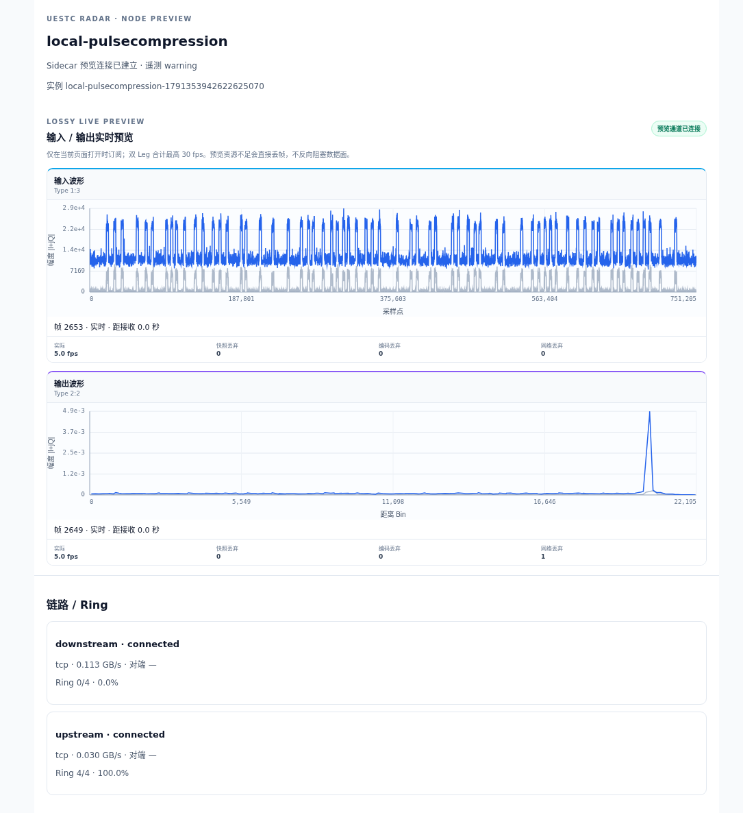

# KT2 本机真实链路验收

2026-10-07，x86_64 宿主通过既有 ARM64 binfmt 运行全部 ARM64 应用；没有 Web/Nginx。一个 project：`uestcradar-kt2`。

## 部署与镜像

在 `workspace/examples/KT2/` 执行：

```bash
docker compose config --quiet
docker compose config --images
docker compose pull
docker compose up -d --no-build
docker compose ps
```

无业务环境文件或变量，无本地构建。实际配置、拉取/启动记录及进程状态见 [配置](kt2-local/compose.json)、[pull](kt2-local/pull.txt)、[up](kt2-local/up.txt)、[ps](kt2-local/ps.txt)。首次运行发现 UI 时钟问题；同次主链运行中仅更新三个 Frontend 为 [正式修正版](frontend-release.md)，没有重启 Worker/Sidecar。

镜像全部检查 linux/arm64、Harbor RepoDigest 与配置一致。Worker IPC 指向本 project 内各自 Sidecar，依赖 service_healthy；Sidecar 保留 shareable IPC/SHM/原健康检查。主链不依赖 Frontend。原两份 Compose 已删除。

## 实际绘图与结果

- `http://127.0.0.1:8082/`，Chrome 实际浏览器观察超过 64 秒。
- IQ `1:3` 输入、脉压 `2:2` 输出，分别记录 **59 个不同 frame_id**；两个 canvas 确实绘制，浏览器异常 0。
- 输入横轴 0–751205 采样点；输出横轴 0–22195 距离 Bin，约 20480 附近有目标峰。沿用原解码/坐标/量化，非随机或 mock 数据。
- Source/Operator/Sink 三页面都核对 node_id、instance_id、类型和可用 Leg，未串节点。
- 默认发布 Worker 不等于仓库反量化开发模板；没有宣称该镜像打印模板的 PASS processed。实际保留原 Sink 门控，持续 64/64 检出。
- 后续执行原 640 脉冲严格 Sink 验收，退出 0：`target_total pulses=640 detected=640 missed=0 status=PASS`。该检查只切换 Sink 消费者，不属于下面的预览隔离窗口。

证据：[浏览器逐次记录](kt2-local/browser.json)、[三页面检查](kt2-local/node-pages.json)、[原数据链日志](kt2-local/worker-sink.txt)、[严格 Sink 日志](kt2-local/strict-sink.txt)。



## 旁路隔离

同次部署按顺序执行，未重新部署主链：

| 操作 | 时长 | Sink 计数变化 |
|---|---:|---:|
| 关闭浏览器页面 | 10 秒 | 199616 → 201472 |
| 使用实际 UI 订阅、缩小接收缓冲且不读 WS | 30 秒 | 201472 → 210688 |
| 停止算法节点 Frontend | 30 秒 | 210688 → 218048 |

Frontend 恢复后约 **0.49 秒**收到有效预览协议帧，随后重新打开页面确认正确绘图/身份。比较 [前](kt2-local/main-before.txt)/[后](kt2-local/main-after.txt) 的所有主链容器 ID、StartedAt、Image ID、IPC，完全一致。详见 [隔离记录](kt2-local/isolation.json)。

验收后对本次 project 执行 `docker compose down`，再开始 KT3；未停止或替换其他工作负载。本结果是功能验证，不是 QEMU 吞吐基准。
