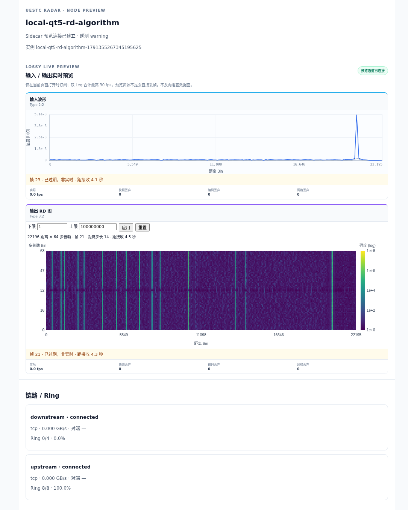

# KT3 本机真实 GFKD / RD 验收

2026-10-07。先结束 KT2，再以一个 project `uestcradar-kt3` 运行全部 ARM64 应用；本机 x86_64 使用既有 binfmt，无 Web/Nginx。

## 部署与必要纠错

```bash
cd workspace/examples/KT3
docker compose config --quiet
docker compose config --images
docker compose pull
docker compose up -d --no-build
docker compose ps
```

默认值全部内置，无额外环境文件、override、构建或源码挂载。四个 Worker 共享各自 Sidecar IPC，并依赖健康检查；RD Worker 保留 init、600000 ms 超时及原 SHM 设置。原两份 Compose 已删除。

首次实际运行证明旧 Sink 固定要求 65 列，退出并让 Ring 回压；未把这种停滞称为通过。随后从**未改动的既有源码与 Dockerfile**在 ARM 构建机发布动态尺寸 Sink，保持同次主链，拉取新 digest 后仅替换失败 Sink。详见 [镜像纠错与发布](frontend-release.md)。原算法未改，不补列、不换假数据、不删除校验。

最终配置与运行记录：[配置](kt3-local/compose.json)、[pull](kt3-local/pull.txt)、[up](kt3-local/up.txt)、[ps](kt3-local/ps.txt)。配置中所有 RepoDigest 实际存在于本机、镜像均为 linux/arm64。

## 真实算法与绘图

- `http://127.0.0.1:8083/`，实际 Chrome 页面连续观察超过 64 秒。
- 输入 `2:2`、输出 `3:2`，各取得 **12 个不同 frame_id**；波形和 RD canvas 实际绘制，浏览器异常 0。
- RD 为 **22196 距离 × 64 多普勒**，距离池化步长 14；横轴距离、纵轴多普勒，0 在下方，固定对数色标 1–1e8。
- 原 GFKD/Worker 输出完成计数与 22196×64；原动态 Sink 验证 metadata、payload、有限值并持续 `[PASSED]`，输出峰位置/幅度与矩阵 SHA256。仍不将格式通过冒充算法精度评估。
- GFKD 程序 SHA256 `b40b670114e1ef9c6a0aca6f1cd29451dcdab57d0e2d780fec62751550d48add`，与本机受保护产物完全一致；CSV 加载正常，运行产物哈希见 [记录](kt3-local/artifact-hashes.txt)。
- 计算约数秒一 CPI，超过 3 秒无新帧时页面明确标为非实时，保留最后图像；新帧到达恢复实时。没有放宽新鲜度阈值以掩盖较慢计算。
- 其他 Source、脉压、RD Sink 页面核对正确节点、instance、类型及 Leg，未串数据。

证据：[浏览器记录](kt3-local/browser.json)、[其余节点页面](kt3-local/node-pages.json)、[Worker/Sink 日志](kt3-local/worker-sink.txt)。



## 旁路隔离

使用修正镜像后的同次主链，不重新部署算法：

| 操作 | 时长 | Sink 计数变化 |
|---|---:|---:|
| 关闭浏览器 | 10 秒 | 42 → 44 |
| 实际订阅、慢 WS 消费者不读取 | 30 秒 | 44 → 49 |
| 停止 RD Frontend | 30 秒 | 49 → 55 |

恢复 Frontend 后 **2.95 秒**浏览器重新显示有效 input/output 帧，身份正确。主链的容器 ID、StartedAt、镜像与 IPC [前](kt3-local/main-before.txt)/[后](kt3-local/main-after.txt) 完全一致，见 [隔离记录](kt3-local/isolation.json)。

本次 project 最后 `docker compose down` 清理。GFKD、四份 CSV 校验和未变；原有本机 11 个容器集合完全不变。尚未进行 Web 内嵌或服务器链路验收。
